# Visual review: fixed footer and About

Temporary Qt/QML mockups rendered with the existing layout and representative test data. The application QML has not been edited to produce these images.

Variants: current header; fixed footer with About as the last Settings section; fixed footer with About dialog. The commit variant shows the short SHA in the footer. Up/down means top/bottom scroll position. Labels and update availability are sample data; behavior and accessibility still need implementation after the visual choice.

| Size and screen | Current | Section | Dialog |
| --- | --- | --- | --- |
| 560x740 inicio | 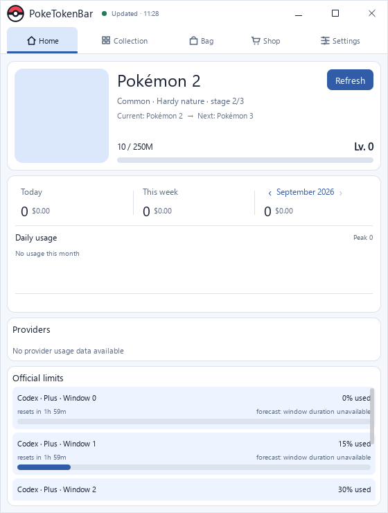 | 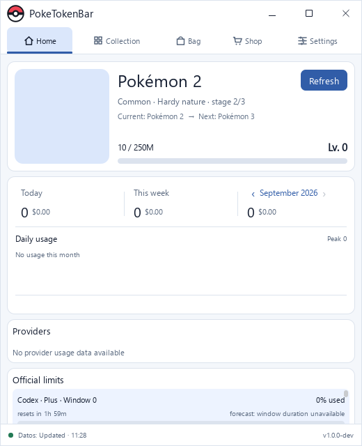 |  |
| 520x640 inicio |  |  |  |
| 560x740 coleccion-arriba | 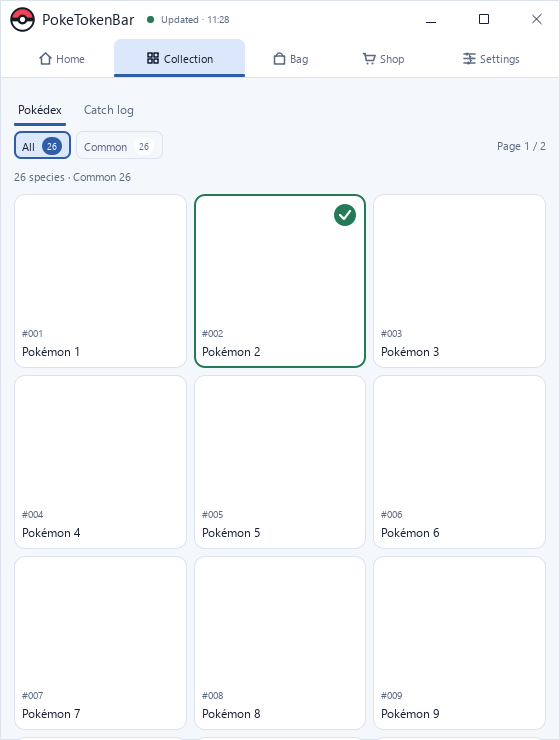 | 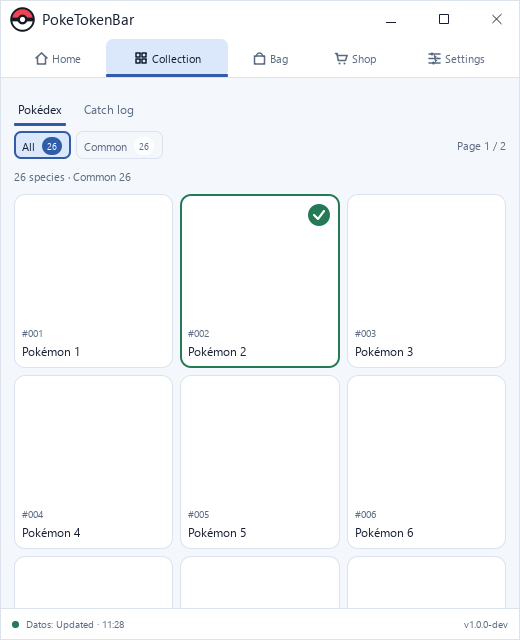 |  |
| 560x740 coleccion-abaixo | 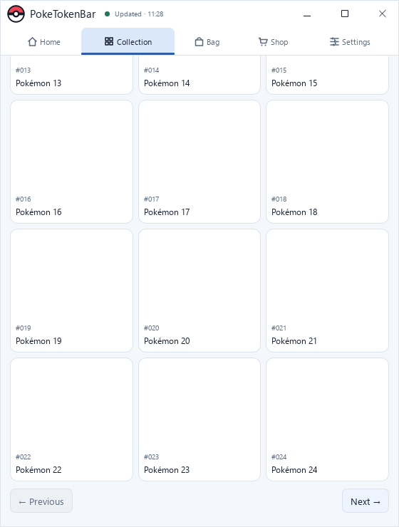 |  |  |
| 560x740 carteira-arriba |  |  |  |
| 560x740 carteira-abaixo | 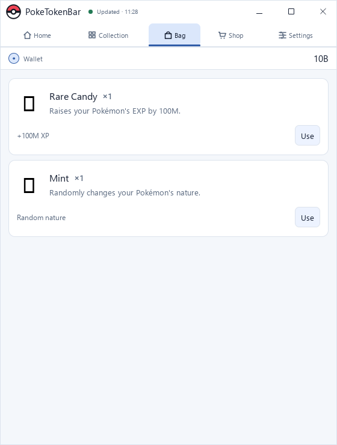 | 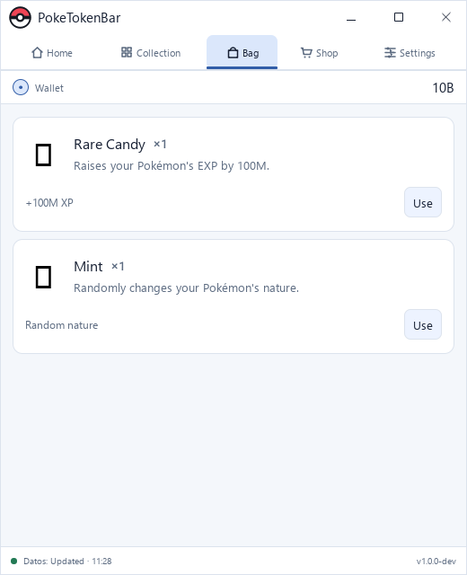 |  |
| 560x740 config-arriba | 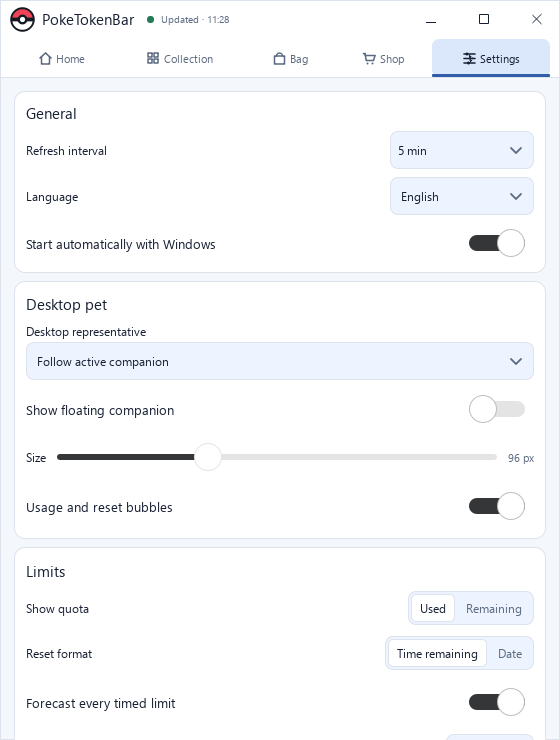 | 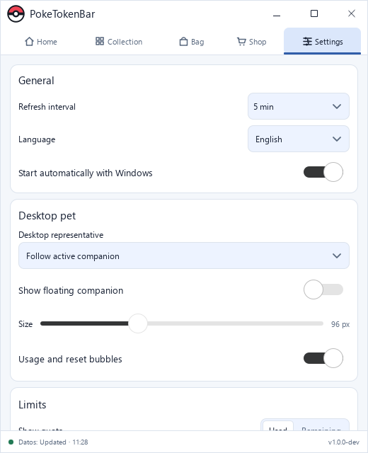 |  |
| 560x740 config-abaixo | 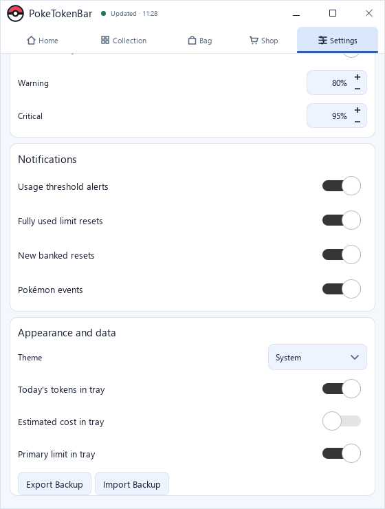 | 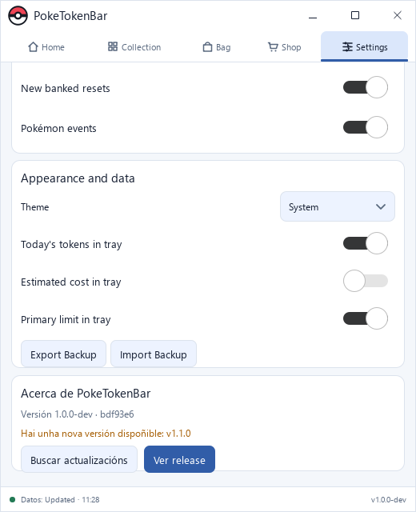 |  |
| 520x640 coleccion-arriba | 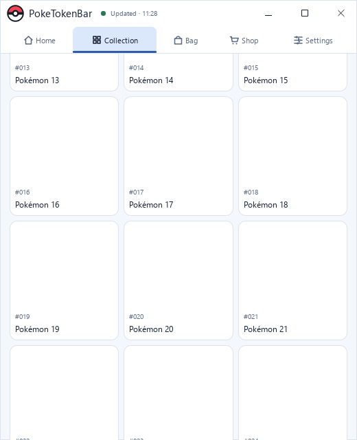 |  |  |
| 520x640 coleccion-abaixo | 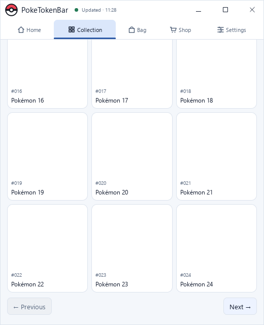 |  | 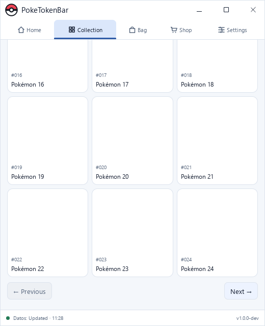 |
| 520x640 carteira-arriba | 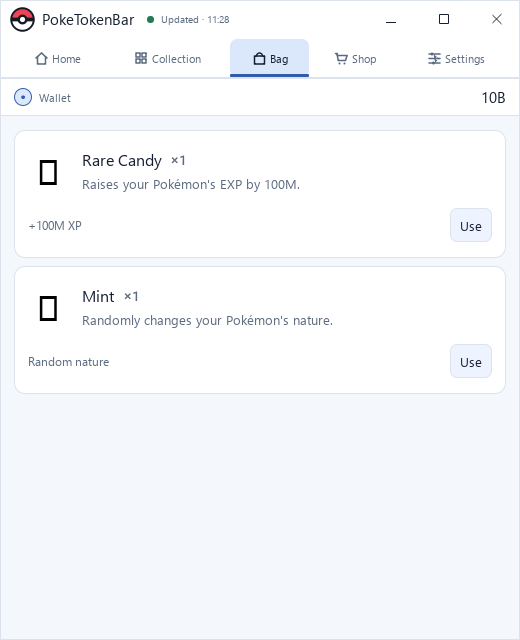 |  |  |
| 520x640 carteira-abaixo |  | 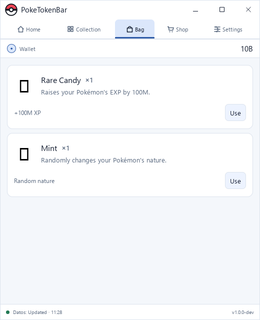 |  |
| 520x640 config-arriba | 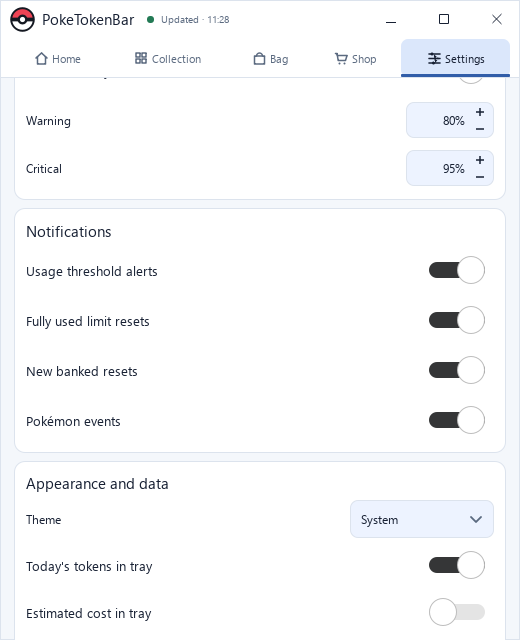 | 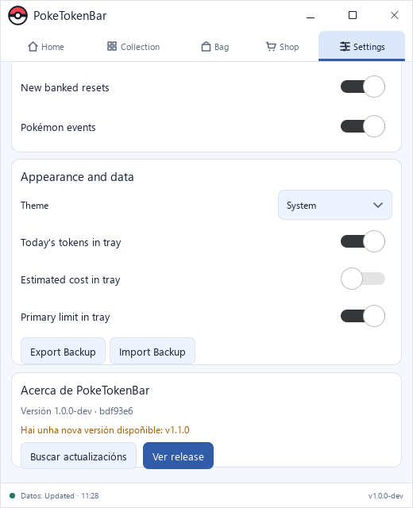 | 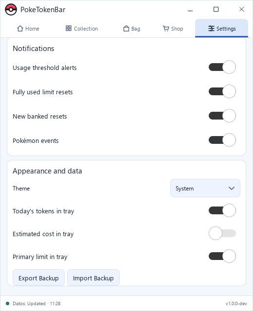 |
| 520x640 config-abaixo | 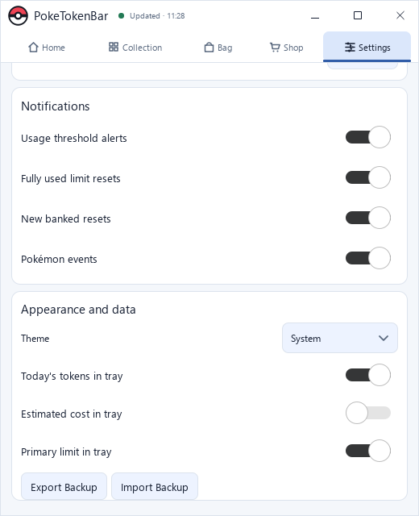 | 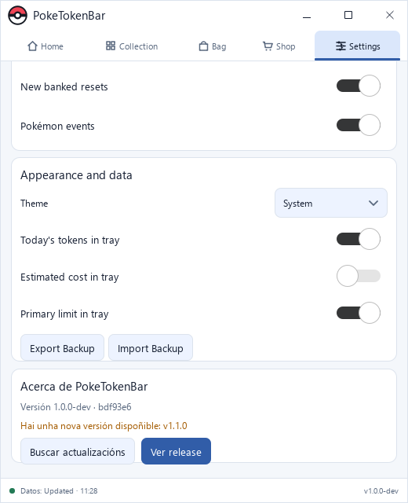 | 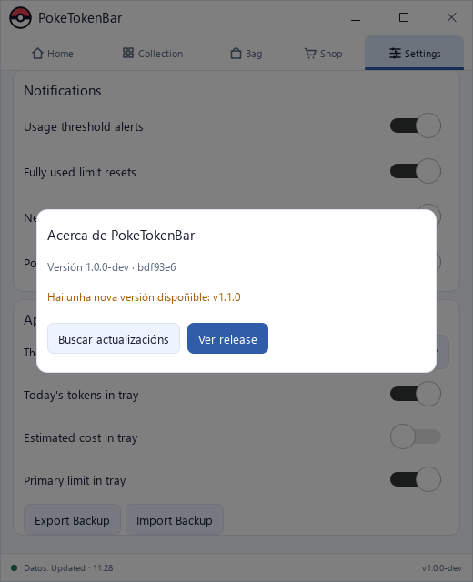 |

Footer with commit: [560 × 740](section-560x740-inicio-commit.png), [520 × 640](section-520x640-inicio-commit.png).

